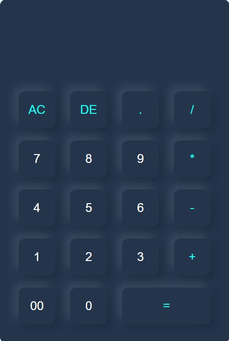

# Simple Calculator Project

This is a basic calculator web application created using HTML and JavaScript. It allows users to perform simple arithmetic calculations right in their web browser.

## Features

- Addition, subtraction, multiplication, and division operations.
- Responsive design for easy use on various devices.
- User-friendly interface with clickable buttons for input.

## Usage

1. Clone the repository to your local machine:

    ```bash
    git clone https://github.com/saoud30/Calculator.git
    ```

2. Open the `index.html` file in your web browser.

3. Use the on-screen buttons or your keyboard to input numbers and perform calculations.

## Preview



## Contributing

If you'd like to contribute to this project, feel free to fork the repository and submit a pull request. Bug reports and feature requests are welcome in the "Issues" tab.

## License

This project is licensed under the MIT License - see the [LICENSE](LICENSE) file for details.

---

Happy calculating!
